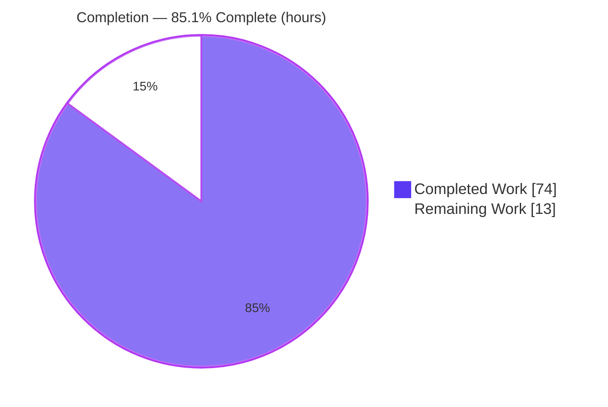
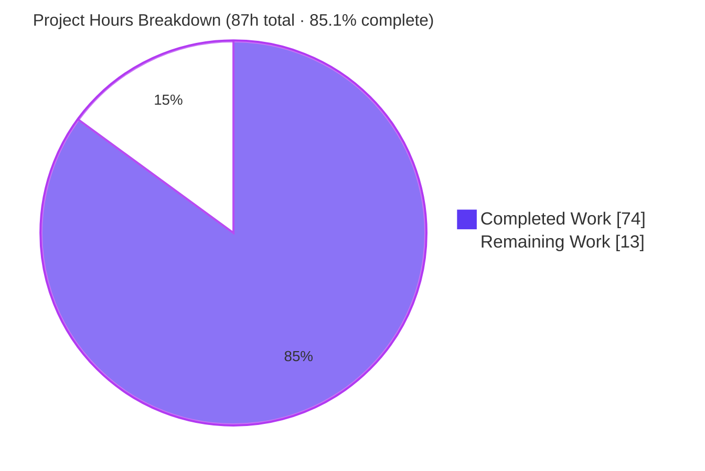
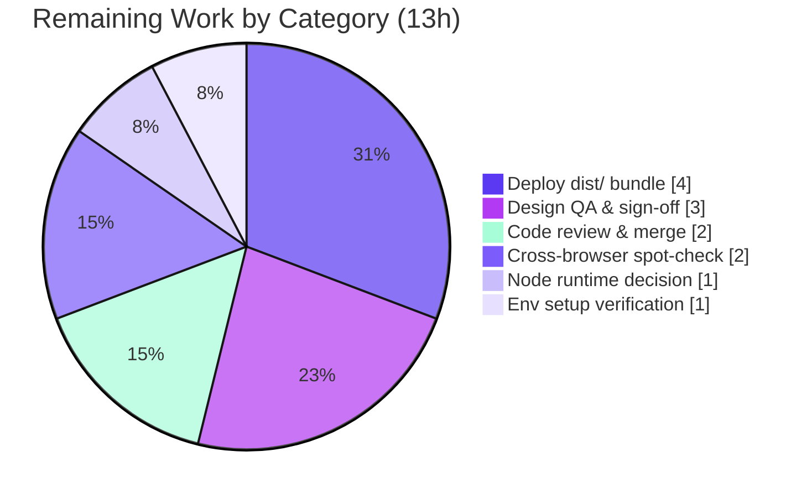

# Blitzy Project Guide — figma-test-7 ("Welcome to Plus UI")

> Pixel-faithful reproduction of the Figma **"Welcome"** screen as a Vite 8 + React 19 + TypeScript single-page front-end, with a Playwright screenshot-verification deliverable.

---

## 1. Executive Summary

### 1.1 Project Overview

This project converts a single Figma **"Welcome"** design (file key `U1wiYiDtkktS3L2hsXteNO`, node `5845:45077`, 1536 × 3324 px) into pixel-faithful, production-quality front-end code, and ships a repeatable mechanism to render and screenshot the page so its visual fidelity can be verified against the source. Starting from an empty greenfield repository (only a one-line `README.md`), Blitzy bootstrapped a complete Vite 8 + React 19 + TypeScript stack, a CSS custom-property design-token layer transcribed verbatim from the design, seven reusable typed components composed into the five-section landing page, all 22 downloaded Figma assets plus 4 self-hosted fonts, and an 861-line Playwright acceptance harness. The target audience is the Plus UI design-system community; the business impact is a demonstrable, deployable marketing/welcome page.

### 1.2 Completion Status

The project is **85.1% complete** on an AAP-scoped basis. Every deliverable defined in the Agent Action Plan (AAP) has been implemented and independently verified; the remaining 13 hours are human path-to-production activities (design sign-off, code review/merge, deployment, runtime decision, browser spot-check, and one-time environment setup).



<div align="center"><strong>85.1% Complete</strong> — 74 of 87 hours</div>

| Metric | Hours |
|---|---|
| **Total Hours** | **87** |
| **Completed Hours (AI + Manual)** | **74** (AI: 74 · Manual: 0) |
| **Remaining Hours** | **13** |
| **Percent Complete** | **85.1%** |

> Colors: **Completed = Dark Blue `#5B39F3`**, **Remaining = White `#FFFFFF`**.

### 1.3 Key Accomplishments

- ✅ Bootstrapped a complete greenfield **Vite 8 + React 19 + TypeScript 5.9** front-end (scaffold, strict TS config, entry HTML with `#root`, ambient asset-module types).
- ✅ Encoded a **single-source design-token layer** (`tokens.css`) transcribing every CONFIRMED Figma color, spacing, radius, gradient, and typographic value verbatim.
- ✅ Built **7 reusable, typed components** (Header, Divider, Link, Icon, Section, PrincipleCard, CommunityCard) composed into a `WelcomePage` at the exact 1344 px column / 96 px padding / 64 px inter-section layout.
- ✅ Integrated all **22 Figma assets** (8 SVG + 14 PNG) downloaded by file key + node ID, plus **4 self-hosted WOFF2 fonts** (Inter 400/500/600, Bubblegum Sans 400).
- ✅ Delivered an **861-line production-grade Playwright acceptance harness** with a self-verifying gate (structural counts, image decode, exact hrefs, font loading, runtime health, exact frame dimensions) — hardened against CWE-345/404/20/532.
- ✅ **All five autonomous validation gates PASS**: dependencies (0 vulnerabilities), compilation (0 errors), verification test (screenshot gate), runtime (0 console errors / 28-of-28 network 200), and files.
- ✅ Rendered output verified at **exactly 1536 × 3324 px** — the Figma frame dimensions — with pixel-accurate tokens confirmed via computed styles.

### 1.4 Critical Unresolved Issues

| Issue | Impact | Owner | ETA |
|---|---|---|---|
| _None._ No blocking or release-critical defects were identified. All AAP deliverables compile, build, pass the acceptance gate, and render cleanly. | None | — | — |

> The only analyzed observation (12 of 23 `` use `alt=""`) was confirmed to be **correct WCAG H67 decorative-image technique**, not a defect — every `` has the `alt` attribute present, meaningful images carry descriptive text, and decorative icons are correctly empty (8 also `aria-hidden`).

### 1.5 Access Issues

| System / Resource | Type of Access | Issue Description | Resolution Status | Owner |
|---|---|---|---|---|
| — | — | **No access issues identified.** The project is fully self-contained (static SPA, no backend, no external credentials, no private registries). All dependencies install from public npm with 0 vulnerabilities; Playwright Chromium is present. | N/A | — |

### 1.6 Recommended Next Steps

1. **[High]** Perform the human pixel-fidelity **design QA sign-off** — compare `screenshots/welcome.png` side-by-side with the Figma "Welcome" frame and approve visual equivalence (3h).
2. **[High]** Complete **final code review and merge** the branch to `main` (2h).
3. **[Medium]** **Deploy** the static `dist/` bundle to a host (Netlify / Vercel / S3+CDN) and smoke-test the live URL (4h).
4. **[Medium]** **Ratify the Node runtime** (22.x currently pinned vs. AAP's 24) across `engines`/`.nvmrc`/CI (1h).
5. **[Low]** **Spot-check** the page in target browsers at the 1536 px design width and verify one-time environment setup on the target/CI machine (3h combined).

---

## 2. Project Hours Breakdown

### 2.1 Completed Work Detail

All rows below are AAP-scoped deliverables, implemented autonomously and independently verified. **Total = 74 hours** (matches Completed Hours in Section 1.2).

| Component | Hours | Description |
|---|---:|---|
| Project scaffold & configuration | 6 | `package.json` (+lockfile), `tsconfig.json`/`tsconfig.node.json` (strict, 8 flags), `vite.config.ts`, `index.html` (`#root`), `.gitignore`, `.nvmrc`, `vite-env.d.ts` — AAP §0.6.1 Group 1 |
| Design-token layer, fonts & global styles | 6 | `tokens.css` (every CONFIRMED token verbatim), `fonts.css` (4 `@font-face`), `global.css` (reset + base) — AAP §0.6.1 Group 2 |
| Application entry | 1 | `main.tsx` (`createRoot` + 3 stylesheet imports), `App.tsx` — AAP §0.6.1 Group 3 |
| Header component | 5 | Gradient hero band, brand lockup, hero copy, external link (node `5845:45213`) |
| Divider component | 1 | 1 px `#9CA3AF` separator (node `4796:80537`) |
| Link component | 4 | Underlined link with optional prefix/suffix icons, size/color variants (node `1965:12013`) |
| Icon component | 2 | Typed SVG-asset wrapper (size/color) |
| Section component | 2 | Heading + body block wrapper (gap 24) |
| PrincipleCard component | 4 | 380 px card: icon cover (`#E0E7FF`) + title + description (node `5845:45122`) |
| CommunityCard component | 4 | 384 px card: logo showcase + brand name + Visit link (node `5845:45179`) |
| WelcomePage composition | 7 | Composes 5 sections + 3 dividers at the exact 1344 / 96 / 64 layout |
| Content data files | 2 | `principles.ts` (6 entries), `communities.ts` (3 entries) |
| Figma asset acquisition & integration | 6 | 22 assets (8 SVG + 14 PNG) downloaded by file key + node ID; 4 self-hosted WOFF2 fonts; wired via ES imports |
| Playwright screenshot-verification tooling | 10 | `capture-screenshots.mjs` (861 LOC, self-verifying acceptance gate, CWE-hardened) + `playwright.config.ts` |
| README documentation | 2 | Full overview, tech stack, prerequisites, commands, structure, design source |
| QA, debugging & fidelity iteration | 12 | Resolution of review findings across 19 commits (F-1..F-8, F4/F5/F6, screenshot hardening, Node reconciliation, render fixes) |
| **Total** | **74** | |

### 2.2 Remaining Work Detail

All rows below are **path-to-production** activities (no AAP deliverable is partial or unstarted). **Total = 13 hours** (matches Remaining Hours in Section 1.2 and the Section 7 pie chart).

| Category | Hours | Priority |
|---|---:|---|
| Pixel-fidelity design QA & sign-off vs Figma | 3 | High |
| Final code review, PR approval & merge to `main` | 2 | High |
| Static hosting/deployment of `dist/` bundle + smoke-test | 4 | Medium |
| Node runtime standardization decision (22 vs 24) & config reconciliation | 1 | Medium |
| Cross-browser / viewport spot-check at 1536 px | 2 | Low |
| One-time environment setup verification (`npm ci` + `npx playwright install chromium`) | 1 | Low |
| **Total** | **13** | |

### 2.3 Hours Calculation Summary

- **Completed Hours** = 74 (Section 2.1 total)
- **Remaining Hours** = 13 (Section 2.2 total)
- **Total Project Hours** = 74 + 13 = **87**
- **Completion %** = 74 ÷ 87 × 100 = **85.1%**

All AAP-scoped autonomous build work is complete and verified; the remaining 13 hours are exclusively human path-to-production closure.

---

## 3. Test Results

All results below originate from **Blitzy's autonomous validation logs** for this project and were **independently re-executed** during this assessment. Per **AAP §0.7.2**, no unit/integration test suites are in scope — the **screenshot-fidelity acceptance gate is the specified verification test**, complemented by the compilation, build, and runtime gates.

| Test Category | Framework | Total | Passed | Failed | Coverage % | Notes |
|---|---|---:|---:|---:|---:|---|
| Screenshot Fidelity Acceptance Gate | Playwright 1.61 (Chromium 1228) | 1 | 1 | 0 | N/A | `npm run screenshot` EXIT=0; asserts 1 h1 / 4 h2 / 9 h3 / 1 main / 5 links / 23 images / 4 font faces at **exactly 1536×3324 px**; emits `screenshots/welcome.png` |
| Type Check (compilation) | TypeScript 5.9 (`tsc -b --force`, strict) | 1 | 1 | 0 | N/A | EXIT=0, **0 type errors** under 8 strict flags (strict, noUnusedLocals/Parameters, verbatimModuleSyntax, isolatedModules, erasableSyntaxOnly, noFallthroughCasesInSwitch, noUncheckedSideEffectImports) |
| Production Build | Vite 8.1.5 | 1 | 1 | 0 | N/A | EXIT=0, 57 modules transformed ~151 ms, **zero warnings/errors**, 17 emitted assets |
| Dependency Audit | npm 11 | 1 | 1 | 0 | N/A | `npm ci` → added 26, audited 27, **0 vulnerabilities** |
| Runtime Health (browser) | Playwright / Chrome subagent | 1 | 1 | 0 | N/A | **0 console errors**, **28/28 network requests HTTP 200**, all fonts/images loaded |
| **Total** | | **5** | **5** | **0** | | **100% pass rate** |

> **Coverage note:** Line/branch coverage is not applicable — the deliverable is a static presentational SPA whose verification is a full-page render acceptance gate (per AAP scope), not a unit-tested code library. There are no failing or blocked tests.

---

## 4. Runtime Validation & UI Verification

Independently re-validated during this assessment via a live `vite preview` server (`http://localhost:4173/`) and a headless Chrome runtime inspection. **Overall verdict: PASS.**

**Runtime health**
- ✅ **Operational** — Preview server responds `HTTP 200` at `/`; HTML shell includes `<title>Welcome to Plus UI</title>` and the `#root` mount node.
- ✅ **Operational** — Hashed JS bundle (`text/javascript`) and CSS bundle (`text/css`) both serve `HTTP 200`.
- ✅ **Operational** — Browser console: **0 errors, 0 warnings** (no favicon 404 — inline SVG data-URI favicon).
- ✅ **Operational** — Network: **28 requests, 28 × HTTP 200, 0 failures** (1 HTML + 4 WOFF2 fonts + JS + CSS + 11 hashed PNGs + 10 inline data-URI images).

**UI structure & fidelity**
- ✅ **Operational** — DOM structure exactly matches: **1 `<h1>`, 4 `<h2>`, 9 `<h3>`, 1 `<main>`, 5 `<a>`, 23 ``**.
- ✅ **Operational** — **23 / 23 images decoded** (`complete && naturalWidth > 0`), **0 broken**.
- ✅ **Operational** — Self-hosted fonts loaded: **Inter 400 / 500 / 600 + Bubblegum Sans 400**; computed styles confirm H1 = Inter 600 48/48, H2 = Inter 500 36/40.
- ✅ **Operational** — Document dimensions **exactly 1536 × 3324 px** (design-frame match).
- ✅ **Operational** — Pixel-accurate tokens via computed styles: hero gradient `linear-gradient(70deg,#312E81 3%,#4338CA 91%)`, annotations `#15803D`, panel `#F3F4F6`, link `#1D4ED8`.

**External links & security**
- ✅ **Operational** — All four destinations wired exactly, each anchor `target="_blank"` + `rel="noopener noreferrer"`: `https://www.plusui.com/`, `https://www.figma.com/@plusui`, `https://discord.gg/Y5a78GGX`, `https://twitter.com/PlusUI_Official`.
- ℹ️ `https://www.figma.com/@plusui` appears twice (community-page link **and** Figma Community card) — **design-intended per AAP §0.1.2/§0.3.1** and the reason the anchor count is 5. Not a defect.

**Visual verification (top-to-bottom)**
- ✅ Gradient hero with Plus UI lockup + `www.plusui.com` link + "Welcome to Plus UI" H1 + subtitle.
- ✅ "Design 20x faster" heading + two paragraphs → divider.
- ✅ "Like & Follow us on Figma Community!" with heart icon, `#F3F4F6` panel, two annotated screenshots, green handwritten "like!"/"follow", blue community link → divider.
- ✅ "Key Principles" 3×2 grid of six cards on `#E0E7FF` covers → divider.
- ✅ "Join Our Communities" row of three cards (Figma Community, Discord, X) with Visit links.
- ✅ Bottom padding, **no footer bar** — matches spec.

_Evidence screenshots: `screenshots/welcome.png` (acceptance harness) and `blitzy/screenshots/welcome_fullpage_1536x3324.png` (runtime inspection) — both PNG 1536 × 3324 RGB._

---

## 5. Compliance & Quality Review

Cross-mapping of AAP requirements and rules (§0.8) to their delivered state. Fixes applied during autonomous validation are noted.

| Benchmark / AAP Requirement | Status | Progress | Evidence / Notes |
|---|---|---|---|
| **R1** — Faithful reproduction of hero + 5 divider-separated sections | ✅ Pass | 100% | All sections render top-to-bottom; runtime 4 h2 / 9 h3 / 5 sections confirmed |
| **R2** — Pixel fidelity (exact colors/dimensions/spacing/radius/gradient/type) | ✅ Pass | 100% | Tokens transcribed verbatim; computed styles confirm exact values; frame 1536×3324 |
| **R3** — Verification screenshots (repeatable capture) | ✅ Pass | 100% | `npm run screenshot` acceptance gate passes; `welcome.png` produced |
| Token-driven styling (all values resolve to `tokens.css`) | ✅ Pass | 100% | `tokens.css` single source; component CSS consumes `var(--*)`; F6-1 refactor applied |
| Assets from Figma by file key + node ID (not recreated) | ✅ Pass | 100% | 22 assets present with documented provenance; 4 self-hosted fonts |
| Semantic, accessible HTML (single `<h1>`, `<h2>` sections, `<a>` links, `alt`) | ✅ Pass | 100% | 1 h1 / 4 h2; all `` have `alt`; decorative images use WCAG H67 `alt=""` + `aria-hidden` |
| Exact external hrefs + `target=_blank` + `rel=noopener noreferrer` | ✅ Pass | 100% | All 4 hrefs exact; reverse-tabnabbing protection on every anchor |
| Raster regions kept as images (not rebuilt as DOM) | ✅ Pass | 100% | "Like & Follow" previews placed as `` per design intent |
| Strict TypeScript, one component per folder + co-located CSS Module | ✅ Pass | 100% | 7 component folders; `tsc -b` clean under 8 strict flags |
| Dependency versions pinned per AAP §0.4 | ✅ Pass | 100% | react 19.2.8, react-dom 19.2.8, vite 8.1.5, plugin-react 6.0.4, ts 5.9.3, playwright 1.61.1 |
| Dependency security (0 vulnerabilities) | ✅ Pass | 100% | `npm audit` → 0 vulnerabilities |
| Screenshot script hardening (CWE-345/404/20/532) | ✅ Pass | 100% | Server identity check, fail-fast guards, sanitized errors (no signed-URL leakage) |
| Runtime platform pin (Node) | ⚠ Advisory | 95% | Settled on Node 22.x (`>=22.12.0`, `.nvmrc=22`) vs AAP's Node 24 — sanctioned environment reconciliation; human ratification recommended (M-2) |
| Deployment / CI/CD | ⚪ Out of AAP scope | — | Explicitly out of scope (§0.7.2); included as path-to-production (Section 2.2) |

**Overall quality posture:** Enterprise-grade. Zero placeholder/TODO/stub anti-patterns in code; comprehensive inline documentation; production-ready error handling in the capture harness.

---

## 6. Risk Assessment

| Risk | Category | Severity | Probability | Mitigation | Status |
|---|---|---|---|---|---|
| Node runtime spec divergence (AAP 24 vs repo 22.x) | Technical | Low | Low | Standardize & document; already reflected in `README`/`.nvmrc`/`engines` | Open decision (M-2) |
| Rasterized preview panels go stale if Figma source changes | Technical | Low | Low | Asset provenance by file key + node ID enables re-download | Accepted (by design) |
| Single fixed 1536 px frame; no responsive breakpoints | Technical | Medium | Medium | AAP scoped only 1536 px; add breakpoints if broader support is required | Accepted (out of scope) |
| Bleeding-edge stack (Vite 8 Rolldown / React 19 / TS 5.9) maturity | Technical | Low | Low | Versions pinned; 0 vulnerabilities; clean build | Mitigated |
| No automated regression tests beyond screenshot gate | Technical | Low | Low | Acceptance gate catches structural regressions; add tests if app grows | Accepted (out of scope) |
| Dependency vulnerabilities | Security | Low | Low | `npm audit` = 0 vulns; periodic audits | Mitigated |
| Reverse-tabnabbing on outbound links | Security | Low | Low | `rel="noopener noreferrer"` always set | Resolved |
| Attack surface (static SPA; no backend/data/auth/secrets/PII) | Security | Low | Low | No server-side surface by design | N/A |
| `dist/` + `screenshots/` gitignored (regenerated per machine/CI) | Operational | Low | Medium | Documented commands; regenerate in CI | Accepted (by design) |
| No CI/CD pipeline | Operational | Medium | Medium | Wrap verified npm scripts in a CI workflow | Open (path-to-production) |
| Playwright Chromium must be installed to run verification | Operational | Low | Medium | Documented one-time `npx playwright install chromium` | Mitigated |
| Third-party external link targets could change/break | Integration | Low | Low | hrefs match design exactly; periodic link check | Accepted |
| Self-hosted font license compliance (Inter & Bubblegum Sans, OFL) | Integration | Low | Low | Confirm OFL & include license files if redistribution requires | Open (minor check) |
| No external service/API integration | Integration | Low | Low | No API keys/credentials/runtime integration surface | N/A |

**Overall risk posture: LOW.** Small-surface, static, dependency-clean, security-hardened. Human-attention items: responsive strategy (if needed), CI/CD, deployment, Node decision, font-license confirmation.

---

## 7. Visual Project Status

**Project hours — Completed vs Remaining** (Completed = `#5B39F3`, Remaining = `#FFFFFF`):



**Remaining hours by category** (from Section 2.2; sums to 13):



**Remaining hours by priority:**

| Priority | Hours | Share |
|---|---:|---:|
| 🔵 High | 5 | 38.5% |
| 🟣 Medium | 5 | 38.5% |
| ⚪ Low | 3 | 23.0% |
| **Total** | **13** | **100%** |

> **Integrity:** "Remaining Work" = **13h** here equals Section 1.2 Remaining Hours and the Section 2.2 total. "Completed Work" = **74h** equals Section 1.2 Completed Hours and the Section 2.1 total.

---

## 8. Summary & Recommendations

**Achievements.** Starting from an empty repository, Blitzy delivered a complete, pixel-faithful reproduction of the Figma "Welcome" screen as a modern Vite 8 + React 19 + TypeScript SPA. Every one of the AAP's file-by-file deliverables (Groups 1–7) is present, and all three feature requirements — faithful section reproduction (R1), pixel fidelity (R2), and verification screenshots (R3) — are satisfied. All five autonomous validation gates pass: dependencies install with **0 vulnerabilities**, TypeScript compiles with **0 errors** under 8 strict flags, the production build emits cleanly, the Playwright acceptance gate passes at **exactly 1536 × 3324 px**, and live-browser runtime inspection shows **0 console errors and 28/28 network requests at HTTP 200**.

**Remaining gaps.** The project is **85.1% complete** on an AAP-scoped basis. The remaining **13 hours** are entirely human path-to-production closure — none is an AAP-item defect: pixel-fidelity design sign-off (3h), code review & merge (2h), static deployment (4h), a Node runtime decision (1h), a cross-browser spot-check (2h), and one-time environment setup verification (1h).

**Critical path to production.** (1) Design sign-off → (2) code review & merge → (3) deploy `dist/` to a static host → (4) ratify the Node runtime → (5) spot-check browsers and confirm environment setup. There are no blocking dependencies between these beyond deploy-after-merge; the two High-priority items gate the release.

**Success metrics.** Acceptance gate green at 1536 × 3324; 0 console errors; 28/28 network 200; 23/23 images decoded; 4/4 fonts loaded; all 4 external hrefs exact and secured; 0 dependency vulnerabilities.

**Production-readiness assessment.** **Ready for release pending human sign-off and deployment.** The codebase is enterprise-grade with no placeholders, comprehensive documentation, and hardened verification tooling. Risk posture is **LOW**. Recommended enhancements beyond AAP scope (not counted in the 13h): add a CI/CD workflow, add responsive breakpoints if broader device support is needed, add a visual-regression suite if the app grows, and confirm OFL font-license inclusion.

| Metric | Value |
|---|---|
| AAP-scoped completion | **85.1%** |
| AAP deliverables complete | **100%** (Groups 1–7 + R1/R2/R3) |
| Autonomous validation gates passing | **5 / 5** |
| Blocking defects | **0** |
| Dependency vulnerabilities | **0** |
| Overall risk posture | **LOW** |

---

## 9. Development Guide

A complete, copy-pasteable guide to build, run, verify, and troubleshoot the project. All commands were tested during this assessment on Linux with Node.js v22.23.1 / npm 11.18.0.

### 9.1 System Prerequisites

- **Node.js 22.x (Active LTS)** — declared via `engines` (`node >=22.12.0`) and pinned in `.nvmrc` (`22`). Vite 8 requires Node `20.19+` or `22.12+`.
- **npm** (bundled with Node.js) — used as the package manager.
- **OS:** Linux/macOS/Windows. ~500 MB free disk for `node_modules` + the Playwright Chromium browser.
- Verify:

```bash
node -v      # expect v22.x
npm -v
cat .nvmrc   # expect: 22
```

> Optional: if you use `nvm`, run `nvm use` in the project root to select Node 22.

### 9.2 Environment Setup

No environment variables are required — the app is a static, self-contained SPA (no backend, no API keys, no secrets). The only optional override is `PREVIEW_URL` consumed by the screenshot script (defaults to `http://localhost:4173`).

### 9.3 Dependency Installation

```bash
# From the repository root — reproducible install from the committed lockfile
npm ci
# Expected: "added 26 packages, and audited 27 packages" then "found 0 vulnerabilities"

# One-time: install the Chromium browser used by the screenshot script
npx playwright install chromium
```

> Use `npm install` instead of `npm ci` if you intend to change dependencies.

### 9.4 Application Startup

```bash
# Development server (hot reload) — http://localhost:5173
npm run dev

# Production build (type-check + bundle) → dist/
npm run build
# Expected: EXIT 0, "57 modules transformed", "built in ~150ms", no warnings

# Preview the production build — http://localhost:4173 (run build first)
npm run preview
```

### 9.5 Verification (the fidelity deliverable)

```bash
# Build first so dist/ exists for the preview server to serve
npm run build

# Capture the full-page verification screenshot
npm run screenshot
# Expected: "Acceptance gate passed: 1 h1 / 4 h2 / 9 h3 / 1 main, 5 links,
#            23 images, 4 font faces, 1536x3324px."
# Output:   screenshots/welcome.png  (PNG 1536 × 3324 RGB)
```

Verify the preview server manually (in a second terminal while `npm run preview` runs):

```bash
curl -s -o /dev/null -w "HTTP %{http_code}\n" http://localhost:4173/   # expect HTTP 200
```

### 9.6 Example Usage

The application is a single standalone page — open `http://localhost:5173` (dev) or `http://localhost:4173` (preview) in a browser and scroll through the five sections. The only interactions are the four outbound links (each opens in a new tab):

| Link | Destination |
|---|---|
| Header "www.plusui.com" | `https://www.plusui.com/` |
| "Visit Plus UI's Figma Community Page" & Figma Community card | `https://www.figma.com/@plusui` |
| Discord card "Visit" | `https://discord.gg/Y5a78GGX` |
| X card "Visit" | `https://twitter.com/PlusUI_Official` |

### 9.7 Troubleshooting

| Symptom | Cause | Resolution |
|---|---|---|
| `npm run screenshot` fails: *"No production build to preview…"* | `dist/` is missing/stale | Run `npm run build` first, then re-run `npm run screenshot` |
| `npm run preview` errors: *"Port 4173 is already in use"* | A previous `vite preview` child is still bound | Find it (`ps -eo pid,cmd \| grep 'vite preview'`) and `kill <pid>`, or use a different `--port` |
| Screenshot script hangs then times out | Chromium not installed | Run `npx playwright install chromium` once |
| Text renders with wrong metrics | Fonts not yet loaded at capture time | The script already awaits `document.fonts.ready`; ensure the 4 WOFF2 files exist under `src/assets/fonts/**` |
| Type or build error after editing | Strict TS violation | Run `npx tsc -b --force` to see the exact diagnostic; the build enforces 8 strict flags |
| `npm audit` reports issues later | Upstream advisory published | Review and update the specific dependency; current state is 0 vulnerabilities |

---

## 10. Appendices

### A. Command Reference

| Command | Purpose |
|---|---|
| `npm ci` | Reproducible install from `package-lock.json` |
| `npm install` | Install/refresh dependencies (when changing deps) |
| `npx playwright install chromium` | One-time Chromium download for screenshots |
| `npm run dev` | Vite dev server with HMR (`:5173`) |
| `npm run build` | `tsc -b && vite build` → `dist/` |
| `npm run preview` | Serve `dist/` locally (`:4173`) |
| `npm run screenshot` | Boot preview + capture `screenshots/welcome.png` |
| `npx tsc -b --force` | Full type-check (read-only) |
| `npm audit` | Dependency vulnerability scan |

### B. Port Reference

| Port | Service | Notes |
|---|---|---|
| 5173 | Vite dev server (`npm run dev`) | Default Vite dev port |
| 4173 | Vite preview server (`npm run preview`) | Serves `dist/`; used by the screenshot script (`--strictPort`) |

### C. Key File Locations

| Path | Role |
|---|---|
| `index.html` | Entry HTML with `#root` and module script |
| `src/main.tsx` | React root; imports token/fonts/global CSS; mounts `<App/>` |
| `src/App.tsx` | Renders `<WelcomePage/>` |
| `src/pages/WelcomePage/` | Five-section page composition (`.tsx` + `.module.css`) |
| `src/components/` | 7 components: Header, Divider, Link, Icon, Section, PrincipleCard, CommunityCard |
| `src/styles/tokens.css` | Single-source design tokens (colors, spacing, radii, gradient, type) |
| `src/styles/fonts.css` | `@font-face` for Inter (400/500/600) + Bubblegum Sans (400) |
| `src/styles/global.css` | Reset + base document styles |
| `src/data/principles.ts` · `communities.ts` | Card content (6 principles · 3 communities) |
| `src/assets/icons/` · `images/` · `fonts/` | 8 SVG · 14 PNG · 4 WOFF2 |
| `scripts/capture-screenshots.mjs` | Playwright acceptance-gate + capture harness |
| `playwright.config.ts` | Playwright configuration |
| `.nvmrc` · `package.json` | Node pin (22) · deps, engines, scripts |

### D. Technology Versions

| Package / Tool | Version | Scope |
|---|---|---|
| Node.js | 22.x (`>=22.12.0`; tested v22.23.1) | runtime |
| npm | 11.x (tested 11.18.0) | package manager |
| react / react-dom | 19.2.8 | runtime |
| vite | 8.1.5 | dev/build |
| @vitejs/plugin-react | 6.0.4 | dev |
| typescript | 5.9.3 | dev |
| @types/react · @types/react-dom | 19.2.17 · 19.2.3 | dev |
| @playwright/test | 1.61.1 (Chromium 1228) | dev/verification |

### E. Environment Variable Reference

| Variable | Default | Purpose |
|---|---|---|
| `PREVIEW_URL` | `http://localhost:4173` | Optional override for the URL the screenshot script targets/reuses |

> No other environment variables are required or consumed — the app ships no runtime configuration.

### F. Developer Tools Guide

- **TypeScript (strict)** is the linting layer (no ESLint per AAP §0.4.3): `npx tsc -b --force` for a read-only check.
- **Vite** provides dev/build/preview; CSS Modules and CSS custom properties are handled natively (no CSS framework).
- **Playwright** drives the headless-Chromium verification; the acceptance gate in `capture-screenshots.mjs` fails fast on any structural/fidelity/runtime shortfall before writing an artifact.
- **Design source of truth:** Figma file key `U1wiYiDtkktS3L2hsXteNO`, node `5845:45077` — see `README.md` → "Design source".

### G. Glossary

| Term | Meaning |
|---|---|
| AAP | Agent Action Plan — the authoritative project directive |
| Acceptance gate | The self-verifying assertions in `capture-screenshots.mjs` that must pass before a screenshot is certified |
| Design token | A named CSS custom property (in `tokens.css`) encoding a confirmed Figma value |
| CSS Module | Component-scoped stylesheet (`*.module.css`) with locally-scoped class names |
| WOFF2 | Compressed web-font format used for the self-hosted Inter and Bubblegum Sans fonts |
| Path-to-production | Standard activities required to deploy the AAP deliverables (deploy, review, environment setup) |
| H67 (WCAG) | Technique of using `alt=""` for decorative images so screen readers skip them |

---

_This guide was generated from independent verification of the repository at HEAD `aa4dac8` on branch `blitzy-eb4cb69d-472e-4f8d-b916-ae50b776f1d0`. All hour figures, test results, and runtime evidence are traceable to the Agent Action Plan and Blitzy's autonomous validation logs._
